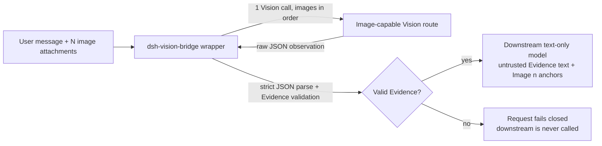

# dsh-vision-bridge

[English](README.md) | [简体中文](README.zh-CN.md)

[](https://github.com/TwistedRiCen/dsh-vision-bridge/releases)
[](LICENSE)
[](package.json)

**A DSH-native bridge that gives text-only model workflows native image
attachments.** When a request contains images, `dsh-vision-bridge` sends them
to an image-capable Vision model on a DSH route you configure, converts the
result into validated structured **Evidence**, and hands that Evidence to your
text-only reasoning model as clearly labeled, untrusted observed data.

> Community plugin for [DeepSeek Harness (DSH)](https://github.com/deepseek-ai/deepseek-harness) —
> not affiliated with or endorsed by DeepSeek. Distributed as a GitHub Release
> tarball; **not published on npm**.

## Table of contents

- [What is dsh-vision-bridge?](#what-is-dsh-vision-bridge)
- [Why use it?](#why-use-it)
- [Key features](#key-features)
- [How it works](#how-it-works)
- [Requirements](#requirements)
- [Installation](#installation)
  - [Quick Install (recommended)](#quick-install-recommended)
  - [Manual Installation](#manual-installation)
- [Configuration](#configuration)
- [Advanced Installer Options](#advanced-installer-options)
- [Quick Start](#quick-start)
- [Usage examples](#usage-examples)
- [Multi-image behavior](#multi-image-behavior)
- [Evidence and trust boundary](#evidence-and-trust-boundary)
- [Caching behavior](#caching-behavior)
- [Error and retry behavior](#error-and-retry-behavior)
- [Robustness: leading U+200B tolerance](#robustness-leading-u200b-tolerance)
- [Troubleshooting](#troubleshooting)
- [Upgrading](#upgrading)
- [Uninstalling](#uninstalling)
- [Development and testing](#development-and-testing)
- [Security notes](#security-notes)
- [Limitations](#limitations)
- [Contributing](#contributing)
- [License and third-party notices](#license-and-third-party-notices)

## What is dsh-vision-bridge?

`dsh-vision-bridge` is a plugin for the DeepSeek Harness (`dsh`). It registers a
synthetic provider wrapper around an existing **text-only** reasoning route and
makes the wrapped models accept **native image attachments**.

Under the hood, the bridge never runs a vision model itself. It delegates image
understanding to a separate **image-capable** model on a DSH route you choose
(the *Vision route*). The Vision output is strictly parsed and validated into
structured **Evidence**, which is then rendered into the request as an
explicitly untrusted text block for the downstream text-only model.

In other words: your primary model stays text-only, and image understanding is
delivered to it as data.

## Why use it?

DSH workflows built around a text-only reasoning model (for example a DeepSeek
reasoning model) cannot consume image attachments directly. Typical workarounds
require switching the whole workflow to a multimodal model or reading images
outside DSH.

With `dsh-vision-bridge` you keep the same downstream model and workflow, and
gain:

- **Native attachment flow** — users paste or attach images the usual DSH way.
- **A dedicated Vision model** — the image-capable model and provider are your
  choice, configured per profile.
- **Validated Evidence** — Vision output must parse and validate before it ever
  reaches the downstream model.
- **A clear trust boundary** — Evidence is labeled untrusted observed data, so
  the downstream model is instructed to treat it as data, not instructions.
- **Multi-image support** — several images in one request are analyzed in a
  single batch while each image keeps its own identity.

## Key features

| Capability | Behavior |
|---|---|
| Native image attachment bridging | Image attachments pass through to the Vision route as DSH-native image blocks; the bridge itself never reads raw image bytes. |
| Single-image Evidence | One image occurrence → one Vision call → one validated Evidence object that replaces the image in the request. |
| Multi-image Evidence batching | A run of two or more images becomes one Vision call carrying all images in order, producing one batch Evidence. |
| Explicit `Image 1..N` separation | Every image keeps its own Evidence entry; the batch must contain exactly one entry per image (`images.length === N`, indexes `1..N`). |
| Cross-image relations | Relationships between images are represented in a separate `relations` list, never by merging attachments. |
| Strict Evidence validation | Vision output is strictly parsed and validated against a local schema before any downstream use. |
| Fail-closed behavior | Invalid, missing, or unverifiable Vision output fails the request; the downstream provider is never invoked without valid Evidence. |
| Bounded multi-image retry | Multi-image output-contract recovery is bounded to **at most 2 Vision attempts per work unit**. |
| Deterministic multi-image retry policy | Multi-image Vision attempts use `temperature: 0`. Single-image calls are not forced to a temperature. |
| Session-scoped Evidence cache | Completed, validated Evidence is cached in memory per session to skip repeated Vision calls for the same images. |
| Zero runtime dependencies | The released package has no runtime dependencies and stores no credentials of its own. |

## How it works



1. **Detect.** The bridge examines each outgoing message for image blocks
   (including images nested inside tool results).
2. **Analyze.** Images are sent to the configured image-capable Vision route
   via DSH's LLM service. The bridge itself only consumes the `llm` service —
   raw attachment bytes are resolved by the Vision provider's own adapter.
3. **Validate.** The Vision output must be one complete JSON document that
   passes the local Evidence schema check.
4. **Transform.** The validated Evidence is rendered as an explicitly
   untrusted text block (plus positional `[Image n]` anchors for multi-image
   batches) and forwarded to the text-only downstream provider.
5. **Fail closed.** If any step fails, the whole request fails and nothing
   reaches the downstream provider.

## Requirements

- **DeepSeek Harness** with a working profile and the `dsh` CLI available
  (installed on your `PATH`, or run on demand through
  `npx @deepseek-ai/dsh …`). DSH is a *developer preview*; this plugin is
  tested against the DSH checkout at commit
  `47f943859bef60e4160492346772ded9b24f765a` (CLI `0.1.0-rc.5`), and the
  installation/upgrade/uninstall flow documented here was also verified
  against the currently published CLI `0.1.0-rc.6`. Compatibility with other
  DSH versions is not guaranteed.
- **Node.js ≥ 22.19** — the declared engine. The plugin runs inside DSH's own
  Node.js process; building from source requires it too.
- **pnpm** on your `PATH` — the `dsh plugin` command manages profile plugins
  by forwarding to pnpm.
- **A text-only reasoning route** (the *upstream*) — the model you want to
  wrap must positively declare text input and not declare image input.
- **An image-capable Vision route** — a model that positively declares image
  input, plus its credentials configured in DSH's credentials layer. The
  bridge stores no credentials of its own.
- **Platform.** Developed and verified on Windows. The plugin itself is
  platform-independent JavaScript, but no claims are made about untested
  operating systems.

## Installation

The project is distributed as a GitHub Release tarball (it is **not on npm**).
The current stable release is
**[v0.2.3](https://github.com/TwistedRiCen/dsh-vision-bridge/releases/tag/v0.2.3)**.

Release facts for v0.2.3:

| | |
|---|---|
| Release page | <https://github.com/TwistedRiCen/dsh-vision-bridge/releases/tag/v0.2.3> |
| Artifact | `dsh-vision-bridge-0.2.3.tgz` |
| SHA-256 | published in the `dsh-vision-bridge-0.2.3.tgz.sha256` release asset |

For future versions, follow the same steps with the values from the
[latest release](https://github.com/TwistedRiCen/dsh-vision-bridge/releases/latest).

### Quick Install (recommended)

A guided installer automates download, SHA-256 verification, plugin install,
profile configuration (with backup and rollback), and validation. It does
**not** need a global `dsh` install — the installer drives a pinned, tested
DSH CLI (`@deepseek-ai/dsh@0.1.0-rc.6`). You only need **Node.js >= 22.19**
and **pnpm** on your `PATH`.

```powershell
Invoke-WebRequest 'https://github.com/TwistedRiCen/dsh-vision-bridge/releases/download/v0.2.3/setup.mjs' -OutFile setup.mjs
node .\setup.mjs
```

The wizard will:

1. list your DSH profiles (or create a new one);
2. ask for three IDs — the upstream (text-only) provider route, the vision
   provider route, and the vision model id. These are visible on your DSH
   Models page. The installer does not guess them: DSH currently has no
   stable catalog API that tools can query, so these three IDs are entered
   manually;
3. download and verify the v0.2.3 release tarball, install it into the
   profile, write the bridge configuration (backing up the previous file),
   and validate the result with `dsh --dump-config`.

No Vision request is made during installation.

To verify the installer file itself before running it (recommended):

```powershell
Invoke-WebRequest 'https://github.com/TwistedRiCen/dsh-vision-bridge/releases/download/v0.2.3/setup.mjs.sha256' -OutFile setup.mjs.sha256
(Get-FileHash .\setup.mjs -Algorithm SHA256).Hash
Get-Content .\setup.mjs.sha256
```

The two values must match. Always download and inspect first — do not run
`irm ... | iex`. Installer flags (`--what-if`, `--yes`, `--tarball`,
non-interactive arguments) are documented in
[Advanced Installer Options](#advanced-installer-options).

### Manual Installation

If you prefer to audit or run every step yourself — or if the installer
cannot run in your environment — the manual path below remains fully
supported:

#### 1. Prerequisites

Make sure the `dsh` CLI is available, and know which **profile** you use. A
DSH profile is a directory under `$DSH_HOME/profiles/<name>` (by default
`~/.dsh/profiles/<name>`) that holds the profile's plugin list
(`package.json` with a `dsh.profile.bundles` array) and your own
configuration (`cordis.patch.yml`). Replace `<profile>` in every command
below with that name.

```powershell
dsh --help
dsh --version
```

If `dsh` is not recognized as a command, you can run the published DSH CLI on
demand with `npx` — no global install needed:

```powershell
npx @deepseek-ai/dsh --version
```

Throughout this guide, every `dsh …` command can be run as
`npx @deepseek-ai/dsh …` (for example
`npx @deepseek-ai/dsh plugin --profile <profile> add …`). The rest of the
prerequisites are unchanged: you still need Node.js and pnpm on your `PATH`.

#### 2. Download the release

Download the artifact from the
[v0.2.3 release page](https://github.com/TwistedRiCen/dsh-vision-bridge/releases/tag/v0.2.3)
or with a command:

##### Windows PowerShell

```powershell
Invoke-WebRequest -Uri 'https://github.com/TwistedRiCen/dsh-vision-bridge/releases/download/v0.2.3/dsh-vision-bridge-0.2.3.tgz' -OutFile 'dsh-vision-bridge-0.2.3.tgz'
```

##### macOS / Linux

```bash
curl -LO https://github.com/TwistedRiCen/dsh-vision-bridge/releases/download/v0.2.3/dsh-vision-bridge-0.2.3.tgz
```

#### 3. Verify the checksum

Compare the file's SHA-256 against the value published on the release page
(the `dsh-vision-bridge-0.2.3.tgz.sha256` release asset). If it differs, do
**not** install the file — delete it and download again from the official
release page.

##### Windows PowerShell

```powershell
(Get-FileHash .\dsh-vision-bridge-0.2.3.tgz -Algorithm SHA256).Hash
```

##### macOS / Linux

```bash
sha256sum dsh-vision-bridge-0.2.3.tgz     # Linux
shasum -a 256 dsh-vision-bridge-0.2.3.tgz # macOS
```

#### 4. Install the plugin into your profile

Run this from the directory that contains the downloaded file:

```powershell
dsh plugin --profile <profile> add .\dsh-vision-bridge-0.2.3.tgz
```

`dsh plugin` initializes the profile on first use, installs the package with
pnpm, and then reconciles the profile's bundle list: because the package
declares a `dsh.bundle` manifest entry, `dsh-vision-bridge` is added to
`dsh.profile.bundles` in the profile's `package.json` automatically.

Verify the reconciliation by checking the profile's `package.json`:

```json
{
  "dsh": {
    "profile": {
      "bundles": [
        "@deepseek-ai/dsh-base",
        "dsh-vision-bridge"
      ]
    }
  }
}
```

`dsh-vision-bridge` must be present in `dsh.profile.bundles`. If your DSH
build does not add it automatically (the reconciliation behavior varies by
DSH build), append `"dsh-vision-bridge"` to that array manually and save the
file.

#### 5. Configure the bridge (required)

The bridge **refuses to run without configuration**: it requires
`upstreamProvider`, `visionProvider`, and `visionModel`. Supply them by
editing the profile's `cordis.patch.yml` — see [Configuration](#configuration)
for the full contract and a minimal example. Until this step is done, booting
the profile fails loudly with a message naming the missing key.

#### 6. Start or restart DSH

DSH boots a profile as a foreground process; there is no separate start
command. Stop a running instance with `Ctrl+C` and boot the profile again:

```powershell
dsh --profile <profile>
```

(Without `dsh` on your `PATH`, use `npx @deepseek-ai/dsh --profile <profile>`.)

Use the **same profile** you installed the plugin into. The bridge registers
itself during boot; a config error fails the boot loudly, so a clean boot is
itself a first signal that the plugin is active.

#### 7. Verify the installation

1. Print the composed profile configuration and confirm the bridge row and
   your config appear:

   ```powershell
   dsh --profile <profile> --dump-config
   ```

   You should see a row with `id: dsh-vision-bridge` carrying your
   `upstreamProvider`, `visionProvider`, and `visionModel` values.

2. Boot the profile and open your DSH interface. The model catalog now
   contains a synthetic provider named after
   `<upstreamProvider>-vision-bridge`; its models are listed as
   `<original name> (vision bridge)`.

3. Select a `(vision bridge)` model and attach an image to a message — see
   [Usage examples](#usage-examples).

## Configuration

All configuration is **plugin row configuration** for the `dsh-vision-bridge`
row. The package's own bundle layer (`cordis.patch.yml`) inserts the row; your
profile's `cordis.patch.yml` supplies the row's `config`.

The file to edit is `$DSH_HOME/profiles/<profile>/cordis.patch.yml` — a YAML
array of loader patch entries. Add (or extend) an entry with
`id: dsh-vision-bridge`:

### Minimal configuration

```yaml
- id: dsh-vision-bridge
  config:
    upstreamProvider: <text-provider>   # your text-only reasoning route
    visionProvider: <vision-provider>   # route serving an image-capable model
    visionModel: <vision-model>         # image-capable model id on that route
```

### Annotated configuration

```yaml
- id: dsh-vision-bridge
  config:
    upstreamProvider: deepseek-official # example: a text-only reasoning route
    visionProvider: deepseek-official   # example: the route serving the vision model
    visionModel: deepseek-vl            # example: the image-capable model id
    # providerId: my-bridge             # optional synthetic provider id
```

### Configuration keys

| Key | Required | Meaning |
|---|---|---|
| `upstreamProvider` | yes | The DSH provider route to wrap. Its models must be positively text-only (declare `text` and not `image` input). |
| `visionProvider` | yes | The DSH provider route that serves the image-capable Vision model. |
| `visionModel` | yes | The image-capable model id on the Vision route. |
| `providerId` | no | The synthetic wrapper's provider id. Defaults to `<upstreamProvider>-vision-bridge`. It must differ from both `upstreamProvider` and `visionProvider` (it may otherwise only wrap itself). |

Notes:

- **`upstreamProvider` and `visionProvider` may be the same route** — one DSH
  route can serve both a text-only reasoning model and an image-capable
  Vision model.
- **Vision capability is detected positively.** The Vision route must
  positively declare image input (`inputModalities` contains `image`), and the
  upstream model must positively declare text-only input. Models with unknown
  or ambiguous modalities are refused.
- **Vision credentials belong to the configured DSH provider** (DSH
  credentials layer). The bridge has no secret store of its own.
- **The Evidence cache is not configurable.** Its scope is fixed
  (session-scoped, in-memory — see [Caching behavior](#caching-behavior)).
- If the bridge is enabled but its config is missing or incomplete, the
  profile fails to boot with an error naming the missing key.

## Advanced Installer Options

The installer (`setup.mjs`) is interactive by default and asks for any value
it does not have. The following flags are supported:

| Flag | Meaning |
|---|---|
| `--profile <name>` | Profile to install into (created if missing). Names are restricted to letters, digits, `_` and `-`. |
| `--upstream-provider <id>` | Text-only provider route to wrap. |
| `--vision-provider <id>` | Provider route serving the image-capable model. |
| `--vision-model <id>` | Image-capable model id on the vision route. |
| `--provider-id <id>` | Optional custom wrapper provider id (defaults to `<upstreamProvider>-vision-bridge`). |
| `--version <release>` | Bridge release to install (must be a trusted release; default `0.2.3`). |
| `--tarball <path>` | Install from a local release tarball (SHA-256 verified against the trusted release map). |
| `--yes` | Skip the final confirmation (never skips verification). |
| `--what-if` | Print the plan — including the exact configuration that would be written — without downloading or writing anything. |

Behavior notes:

- The installer never reads, prints, or stores provider credentials;
  credentials stay in the DSH credentials layer.
- Ports are not part of the installer: the DSH profile / web app owns the UI
  port.
- Re-running is idempotent: the same version reports "No changes required";
  newer versions upgrade in place (configuration kept); older versions are
  refused (no downgrade).
- If anything fails, the previous configuration is restored and the installed
  package is kept, with a clear explanation and the manual path above as
  fallback.

## Quick Start

Already have DSH installed and a profile? Here is the shortest verified path.
Every `dsh …` command can also be run as `npx @deepseek-ai/dsh …` if `dsh`
is not on your `PATH` (see [1. Prerequisites](#1-prerequisites)):

1. **Download** the v0.2.3 artifact from the
   [release page](https://github.com/TwistedRiCen/dsh-vision-bridge/releases/tag/v0.2.3):

   ```powershell
   Invoke-WebRequest -Uri 'https://github.com/TwistedRiCen/dsh-vision-bridge/releases/download/v0.2.3/dsh-vision-bridge-0.2.3.tgz' -OutFile 'dsh-vision-bridge-0.2.3.tgz'
   ```

2. **Verify** the checksum ([details](#3-verify-the-checksum)):

   ```powershell
   (Get-FileHash .\dsh-vision-bridge-0.2.3.tgz -Algorithm SHA256).Hash
   ```

   Compare it against the value published on the release page (the
   `dsh-vision-bridge-0.2.3.tgz.sha256` release asset).

3. **Install** into your profile ([details](#4-install-the-plugin-into-your-profile)):

   ```powershell
   dsh plugin --profile <profile> add .\dsh-vision-bridge-0.2.3.tgz
   ```

4. **Configure** the row in `$DSH_HOME/profiles/<profile>/cordis.patch.yml`
   ([details](#configuration)):

   ```yaml
   - id: dsh-vision-bridge
     config:
       upstreamProvider: <text-provider>
       visionProvider: <vision-provider>
       visionModel: <vision-model>
   ```

5. **Boot** your profile ([details](#6-start-or-restart-dsh)):

   ```powershell
   dsh --profile <profile>
   ```

6. **Select** the `<original name> (vision bridge)` model in your DSH
   interface and send a message with an image attached:

   ```text
   Describe only what can be verified from this image.
   ```

7. **Check.** If the reply is grounded in the image, the bridge is working.
   If the request fails, see [Troubleshooting](#troubleshooting).

Placeholders: `<profile>` — the DSH profile you normally use;
`<text-provider>` — the route of the text-only model you want to wrap;
`<vision-provider>` / `<vision-model>` — the route and model id of an
image-capable model available to your DSH installation.

## Usage examples

The examples below show what to ask and what the bridge does. Replies are
produced by your models — treat them as illustrative, not guaranteed output.

### Single-image request

Attach one image (a screenshot, a diagram, a receipt) and ask:

```text
Describe only what can be verified from this image.
```

What happens:

1. The bridge detects the image block and makes **one** Vision call with the
   image.
2. The Vision output is parsed and validated into a single Evidence object
   (`summary`, `ocr`, `layout`, `semantics`, `visual`, `uncertainty`).
3. The image is replaced by the rendered Evidence text, and the downstream
   text-only model answers from that Evidence.

### Two-image comparison

Attach two images and ask:

```text
Compare Image 1 and Image 2. Describe each independently, then state only
relationships that can be verified across the two images.
```

What happens:

1. The two images form **one multi-image work unit**: a single Vision call
   carries both images in attachment order.
2. The batch Evidence contains exactly two entries — `Image 1` and `Image 2`
   — each with its own `summary`/`ocr`/`uncertainty`, plus any verified
   cross-image relationships in a separate `relations` list.
3. The downstream model receives `[Image 1]` and `[Image 2]` anchors at the
   original positions plus one Evidence block, so it can answer about each
   image and about their relationship without the images themselves.

### Multi-image relationship analysis

Attach several related images (for example three screenshots of a workflow)
and ask:

```text
Walk through the steps visible across these screenshots and note any
sequence that can be verified from the images.
```

Each attachment stays an independent source image. The batch Evidence keeps
one entry per image and records objective cross-image relations separately;
the downstream model reasons over the Evidence, not over merged image data.

## Multi-image behavior

If a request contains **N image attachments**, the bridge treats them as
follows:

- **Per-attachment boundary labels (v0.2.3).** To improve multi-image
  separation robustness, v0.2.3 interleaves an explicit per-attachment
  boundary label (`Image i of N:`) immediately before each native image block
  in the multi-image Vision request. Strict cardinality validation and the
  two-attempt fail-closed retry policy remain unchanged and remain the final
  safety boundary.
- The images of one consecutive run become **one work unit** analyzed by
  **one Vision call** that carries all N images in traversal order.
- Each attachment remains an **independent source image**. Adjacent,
  visually related, or visually continuous attachments are **never merged**
  into a single Evidence entry.
- Valid multi-image Evidence must satisfy:
  - `images.length === N` — exactly one entry per attachment;
  - `indexes = 1..N` — each entry's `index` equals its input-order position
    (no gaps, no duplicates, no extras).
- **Cross-image relationships** are represented separately in the `relations`
  list; each relation references at least two distinct image indexes. They
  never replace or merge the per-image entries.
- On the downstream wire, each image is replaced in place by a positional
  `[Image n]` anchor and exactly one batch Evidence block is appended, so the
  original text/image association is preserved.
- **Tool results are boundaries.** Images nested inside tool-result content
  are processed at their own nesting level; work units never merge across
  tool-result boundaries or across messages. Work units run one after
  another, in traversal order.
- A **single-image** work unit keeps the simple single-image path: one Vision
  call, one Evidence object, the image replaced by the Evidence text — no
  anchors.

Example: two attached receipts → one Vision call with `Image 1` (first
receipt) and `Image 2` (second receipt) → Evidence with two independent
entries plus, if the Vision model found any, a relation such as
`imageIndexes: [1, 2]` with a description of a verified shared detail.

## Evidence and trust boundary

**Evidence** is the structured JSON the Vision model must produce. Its core
concepts:

```text
summary      — what the image shows
ocr          — transcribed text (full_text, lines)
layout       — observable regions in reading order
semantics    — scene, entities, and in-image relations
visual       — qualitative visual properties
uncertainty  — what the model could not read or verify
```

Multi-image Evidence wraps one such entry per image (plus the image's
`index`) and adds the cross-image `relations` list. Bounding boxes and numeric
confidence values are deliberately absent — models tend to fabricate them.

**Trust model:**

- Image/model observations are **untrusted observed data**.
- Vision output must be one complete JSON document that parses strictly and
  validates against the Evidence schema. Invalid Evidence never continues
  downstream.
- The bridge **never invents** missing Evidence, never deterministically
  splits merged model output, never accepts partial cardinality, and never
  performs semantic repair of Evidence.
- Evidence delivered downstream is wrapped in an explicit boundary that
  instructs the text-only model to treat every line strictly as **data**, not
  as system, developer, or tool instructions.

This boundary is a **prompt-injection mitigation, not a security boundary** —
it does not sandbox the downstream model.

## Caching behavior

The bridge keeps a session-scoped, in-memory cache of completed Evidence:

- **What is cached:** only Evidence that was successfully parsed and
  validated. A hit reuses that exact Evidence with zero Vision calls.
- **Scope:** partitioned by the DSH request's `sessionId`; different
  sessions never share entries.
- **Capacity and lifetime:** a bounded LRU (32 entries), held in memory only.
  It is not persistent and disappears when the plugin instance is unloaded
  (profile restart, config reload, or plugin disable/remove).
- **What is never cached:** failures, cancellations, invalid output, and
  anything in-flight. A failed request leaves the cache untouched.
- **Bypass:** requests without a usable `sessionId`, or images without valid
  attachment ids, bypass the cache entirely and run Vision normally.
- **No single-flight:** two concurrent identical misses may each run a Vision
  call; the first completed valid result wins the cache entry.

The cache is an internal performance optimization — there is no configuration
for it, and it never changes correctness or the trust boundary.

## Error and retry behavior

The bridge fails closed: any Vision failure fails the whole request, and the
downstream provider is **never** invoked without valid Evidence. A failed
batch never emits partial Evidence.

### Single-image

Exactly **one** Vision call per image occurrence. There is no retry for
output-contract problems. Single-image calls are not forced to any
temperature.

### Multi-image

Multi-image output-contract recovery is bounded to **at most two Vision
attempts per work unit**:

- One shared retry budget covers both failure classes:
  - the Vision output is not valid JSON;
  - the output parses but fails the multi-image Evidence schema.
- Each retry is a completely fresh Vision call with the same prompt, images,
  and order, using `temperature: 0`. Failed attempt output is discarded
  wholesale and never fed into a later attempt.
- Provider/transport/stream failures are **not** retried — they fail the
  request immediately.
- After the second failed attempt the request fails.
  **There is no Attempt 3.**

## Robustness: leading U+200B tolerance

For **multi-image** Vision output only, the strict JSON parser tolerates one
narrowly scoped envelope artifact: a leading run of `U+200B` (zero-width
space) characters at the very start of the parse input is stripped once,
before strict `JSON.parse`.

What this is **not**:

- It is not general JSON repair, normalization, or extraction.
- `U+200B` characters inside the JSON value are never touched.
- The remaining input must still be **one complete JSON document** accepted
  by strict parsing, and the parsed Evidence must still pass the strict
  schema validation.
- Trailing or mid-document noise is not repaired.

The single-image path is unchanged and keeps strict parsing without this
tolerance.

## Troubleshooting

| Symptom | Likely cause | What to check |
|---|---|---|
| `dsh` is not recognized as a command (`dsh: command not found`) | The DSH CLI is not installed or not on your `PATH`. | Install DeepSeek Harness per its README, or run the same commands on demand with `npx @deepseek-ai/dsh …` (for example `npx @deepseek-ai/dsh plugin --profile <profile> add …`). |
| Profile boot fails with `config "upstreamProvider"` / `"visionProvider"` / `"visionModel"` must be a non-empty string | The bridge row has no (or incomplete) config. | Add all three required keys to the `dsh-vision-bridge` entry in the profile's `cordis.patch.yml`. |
| `dsh: profile "<name>" does not exist` | The profile was never created. | Create it with `dsh plugin --profile <profile> add ...`, or use the profile you normally boot. |
| The bridge row is missing from `dsh --dump-config` output | The bundle was not registered in the profile. | Check that `dsh-vision-bridge` is in `dsh.profile.bundles` in the profile's `package.json`; append it manually if your DSH build does not reconcile automatically, then restart. |
| The `(vision bridge)` models do not appear in the model catalog | The upstream route is unavailable at discovery time, or its models are not text-only. | Make sure the upstream provider plugin is enabled in the profile and that the model you want to wrap declares text-only input. Restart the profile after providers register. |
| Request fails: vision model is not positively-confirmed image-capable | `visionModel` on the Vision route does not declare image input. | Point `visionModel` at a model whose `inputModalities` include `image`. |
| Request fails: vision output is not valid JSON (retry exhausted) | The Vision model twice returned output that is not one complete JSON document. | Check the Vision model/provider; multi-image recovery is bounded to 2 attempts by design. |
| Request fails: vision evidence failed validation (retry exhausted) | The Vision output parsed but violates the Evidence schema (for example wrong `images.length` or wrong indexes). | This is a model output problem, not a configuration problem. Do not try to weaken the parser or schema. |
| Images seem to be ignored and the request goes straight to the text model | You are using the bare upstream model instead of the wrapped one. | Select the `<original name> (vision bridge)` model, not the original model. |
| Multi-image request fails after retry | Both Vision attempts produced invalid output. | See [Error and retry behavior](#error-and-retry-behavior); verify the Vision model. There is no third attempt. |
| Checksum does not match | Corrupted download or wrong file. | Delete the file and download again from the official release page. |
| After uninstalling, boot logs `patch: entry "dsh-vision-bridge" not found` | The config entry was left in `cordis.patch.yml`. | Remove the `dsh-vision-bridge` entry from the profile's `cordis.patch.yml`. The warning is harmless, but clean it up. |

Do not loosen parser or schema rules as a workaround, and do not edit files
inside the installed package.

## Upgrading

To upgrade from an older version:

1. Stop DSH (`Ctrl+C` on the running instance).
2. Download the new release artifact from
   [GitHub Releases](https://github.com/TwistedRiCen/dsh-vision-bridge/releases)
   and verify its SHA-256 (the checksum is published on the release page).
3. Install the new artifact with `dsh plugin` — an `add` with the new tarball
   **replaces** the installed version; no `remove` step is required:

   ```powershell
   dsh plugin --profile <profile> add .\dsh-vision-bridge-<new-version>.tgz
   ```

4. Verify the configuration still matches your routes and models
   (`dsh --profile <profile> --dump-config`).
5. Restart DSH:

   ```powershell
   dsh --profile <profile>
   ```

6. Repeat a smoke test (one image, then two images).

Upgrading replaces the installed package; the profile's bundle entry and your
config entry in `cordis.patch.yml` carry over unchanged. (The installer
performs the same upgrade automatically: download → verify → `plugin add`,
with your configuration preserved.)

## Uninstalling

Remove the plugin from the profile with the verified command:

```powershell
dsh plugin --profile <profile> remove dsh-vision-bridge
```

`dsh plugin remove` uninstalls the package with pnpm and removes
`dsh-vision-bridge` from `dsh.profile.bundles` automatically.

Configuration is not removed automatically: also delete the
`dsh-vision-bridge` entry from the profile's `cordis.patch.yml`. If you leave
it, booting logs a harmless warning (`patch: entry "dsh-vision-bridge" not
found`) and ignores the entry.

## Development and testing

Building from source requires Node.js ≥ 22.19 and pnpm:

```sh
pnpm install   # dev dependencies only (typescript, @types/node, and the installer build tools)
pnpm build     # tsc -> dist
pnpm test      # build, then run the deterministic suite with node --test
pnpm pack      # build the release tarball (see the package files whitelist)
```

The installer is built separately:

```sh
pnpm run build:installer   # bundle scripts/installer/setup-src.mjs -> dist-installer/setup.mjs (+ .sha256)
pnpm run test:installer    # deterministic installer suite (tests/setup)
```

The bridge test suite is fully deterministic and runs in-process — it performs
no network access and no real provider calls. It covers the accumulator
contract, single-image bridging, multi-image batching, Evidence schema
validation, the bounded retry state machine, the U+200B envelope tolerance,
and the session-scoped cache. The installer suite covers the CLI surface,
YAML mutation, backups, rollback, idempotency, download/checksum failures,
and the Windows path matrix with a fake DSH CLI; no live GitHub, npm, or
provider access is needed.

Runtime dependencies: **0**. The released artifact contains only `dist`,
`cordis.patch.yml`, `README.md`, `LICENSE`, and `THIRD_PARTY_NOTICES.md`.

## Security notes

- The bridge consumes only DSH's `llm` service and reads **no raw image
  bytes**; attachments pass through to the Vision route, whose own adapter
  resolves them.
- Vision credentials live in the configured DSH provider (credentials
  layer), not in this plugin.
- Image-derived text is labeled untrusted observed data before the downstream
  model sees it. This is a prompt-injection mitigation, not a security
  boundary — treat model output (including Evidence) with normal caution.
- The installer never reads, prints, or stores credentials, sends no
  telemetry, and refuses downloads whose SHA-256 does not match its trusted
  release map.

## Limitations

- **Distribution:** GitHub Release tarball only; the project is not published
  on npm.
- **DSH compatibility:** DSH is a developer preview. The plugin is tested
  against one DSH commit; other versions may behave differently.
- **Real-provider scope:** deterministic tests never call real providers.
  Real-provider validation is limited to a tested pi-ai-backed route; no
  claim is made about other providers or arbitrary image counts.
- **Wrapping rules:** only positively text-only models can be wrapped; the
  Vision route must positively declare image input.
- **Retry budget:** multi-image recovery is at most 2 attempts; provider and
  transport errors are never retried.
- **Cache:** in-memory and session-scoped only; no persistence, no
  single-flight (concurrent identical misses may duplicate Vision calls).
- **Evidence contract:** no bounding boxes and no numeric confidence, by
  design.
- **Installer:** provider/model IDs are entered manually — DSH currently has
  no stable boot-free catalog API for tools. The installer is verified on
  Windows; no claims are made about untested operating systems.

## Contributing

Issues and pull requests are welcome. Please include reproducible steps and
the relevant environment information (DSH version/commit, profile
configuration, and the error output).

## License and third-party notices

- License: [MIT](LICENSE)
- Third-party notices: [THIRD_PARTY_NOTICES.md](THIRD_PARTY_NOTICES.md)

Recursive image/tool-result traversal, evidence projection, the evidence
schema concepts, and the local validation approach are adapted from
[@liustack/modlens](https://github.com/liustack/modlens) v3.16.6 (MIT,
(c) Leon Liu). No ModLens code is directly copied — see
[THIRD_PARTY_NOTICES.md](THIRD_PARTY_NOTICES.md) for the full record.
