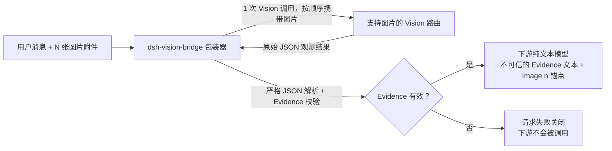

# dsh-vision-bridge

[English](README.md) | [简体中文](README.zh-CN.md)

[](https://github.com/TwistedRiCen/dsh-vision-bridge/releases)
[](LICENSE)
[](package.json)

**一个 DSH 原生的桥接插件，让纯文本模型工作流获得原生图片附件能力。** 当请求中包含图片时，`dsh-vision-bridge` 会把图片发送给你配置的 DSH 路由上的视觉（Vision）模型，将返回结果转换为经过校验的结构化 **Evidence（证据数据）**，再以明确标记为不可信观测数据的文本形式交给下游的纯文本推理模型。

> 这是 [DeepSeek Harness (DSH)](https://github.com/deepseek-ai/deepseek-harness) 的社区插件 ——
> 与 DeepSeek 无隶属关系，也未获得其背书。通过 GitHub Release 的 tarball 分发；
> **未发布到 npm**。

## 目录

- [dsh-vision-bridge 是什么？](#dsh-vision-bridge-是什么)
- [为什么使用它？](#为什么使用它)
- [核心特性](#核心特性)
- [工作原理](#工作原理)
- [环境要求](#环境要求)
- [安装](#安装)
  - [快速安装（推荐）](#快速安装推荐)
  - [手动安装](#手动安装)
- [配置](#配置)
- [安装器高级选项](#安装器高级选项)
- [快速上手](#快速上手)
- [使用示例](#使用示例)
- [多图行为](#多图行为)
- [Evidence 与信任边界](#evidence-与信任边界)
- [缓存行为](#缓存行为)
- [错误与重试行为](#错误与重试行为)
- [健壮性：前导 U+200B 容错](#健壮性前导-u200b-容错)
- [故障排查](#故障排查)
- [升级](#升级)
- [卸载](#卸载)
- [开发与测试](#开发与测试)
- [安全说明](#安全说明)
- [已知限制](#已知限制)
- [参与贡献](#参与贡献)
- [许可证与第三方声明](#许可证与第三方声明)

## dsh-vision-bridge 是什么？

`dsh-vision-bridge` 是 DeepSeek Harness（`dsh`）的一个插件。它在一个现有的
**纯文本**推理路由上注册一个合成 provider 包装器，让被包装的模型能够接收
**原生图片附件**。

在底层，该桥接插件本身并不运行视觉模型，而是把图片理解委托给一个由你选定
的、位于 DSH 路由上的**支持图片**的模型（即 *Vision 路由*）。Vision 输出会被
严格解析并校验为结构化的 **Evidence（证据数据）**，然后以明确标记为不可信
数据的文本块形式写入请求，交给下游的纯文本模型。

换句话说：你的主模型保持纯文本不变，图片理解能力以“数据”的形式喂给它。

## 为什么使用它？

围绕纯文本推理模型（例如 DeepSeek 推理模型）构建的 DSH 工作流无法直接消费
图片附件。常见的变通做法要么是把整个工作流换成多模态模型，要么是在 DSH 之外
读取图片。

使用 `dsh-vision-bridge` 后，下游模型和工作流保持不变，同时获得：

- **原生附件流程** —— 用户像平时一样粘贴或上传图片，无需额外步骤。
- **专属 Vision 模型** —— 图片模型与 provider 由你在每个 profile 中自行配置。
- **经过校验的 Evidence** —— Vision 输出必须先通过解析与校验，才能到达下游模型。
- **清晰的信任边界** —— Evidence 被标记为不可信的观测数据，明确指示下游模型
  将其当作数据而非指令对待。
- **多图支持** —— 同一请求中的多张图片会在一次批处理中分析，同时每张图片
  保留各自独立的身份。

## 核心特性

| 能力 | 行为 |
|---|---|
| 原生图片附件桥接 | 图片附件以 DSH 原生 image block 的形式直达 Vision 路由；桥接插件自身从不读取原始图片字节。 |
| 单图 Evidence | 一次图片出现 → 一次 Vision 调用 → 一份经过校验的 Evidence 对象，原位替换请求中的图片。 |
| 多图 Evidence 批处理 | 两张及以上图片的连续片段合并为一次 Vision 调用，按顺序携带全部图片，产出整批 Evidence。 |
| 明确的 `Image 1..N` 分离 | 每张图片都有独立的 Evidence 条目；批次必须恰好每张图片一个条目（`images.length === N`，索引 `1..N`）。 |
| 跨图关系 | 图片之间的关系用单独的 `relations` 列表表达，绝不通过合并附件来表示。 |
| 严格的 Evidence 校验 | Vision 输出在用于下游之前，必须通过严格的 JSON 解析与本地 schema 校验。 |
| 失败关闭（fail closed） | 无效、缺失或无法核验的 Vision 输出会使整个请求失败；下游 provider 绝不会在没有有效 Evidence 的情况下被调用。 |
| 有界多图重试 | 多图输出契约恢复**每个工作单元最多 2 次 Vision 尝试**。 |
| 确定性的多图重试策略 | 多图 Vision 尝试使用 `temperature: 0`；单图调用不受温度强制约束。 |
| 会话级 Evidence 缓存 | 已通过校验的 Evidence 按会话缓存在内存中，相同图片可跳过重复的 Vision 调用。 |
| 零运行时依赖 | 发布包没有运行时依赖，也不自行保存任何凭据。 |

## 工作原理



1. **检测。** 桥接插件检查每条待发送消息中的图片块（包括嵌套在工具结果里的图片）。
2. **分析。** 图片通过 DSH 的 LLM 服务发送到配置好的、支持图片的 Vision 路由。
   桥接插件只消费 `llm` 这一个服务 —— 原始附件字节由 Vision provider 自己的
   adapter 解析。
3. **校验。** Vision 输出必须是一个完整的 JSON 文档，并通过本地 Evidence
   schema 校验。
4. **转换。** 校验通过的 Evidence 被渲染为明确标记为不可信的文本块（多图批次
   附带位置锚点 `[Image n]`），转发给下游纯文本 provider。
5. **失败关闭。** 任何一步失败，整个请求失败，不会有任何内容到达下游 provider。

## 环境要求

- **DeepSeek Harness** 以及一个可用的 profile，并且 `dsh` CLI 可用（已安装到
  `PATH`，或通过 `npx @deepseek-ai/dsh …` 按需运行）。DSH 目前处于*开发者
  预览*阶段；本插件在 DSH 检出点 commit
  `47f943859bef60e4160492346772ded9b24f765a`（CLI `0.1.0-rc.5`）上通过验证，
  本文档中的安装/升级/卸载流程也已在当前发布的 CLI `0.1.0-rc.6` 上复验通过。
  不保证与其他 DSH 版本兼容。
- **Node.js ≥ 22.19** —— 声明的运行时引擎。插件运行在 DSH 自身的 Node.js
  进程内；从源码构建也需要满足该版本。
- **PATH 中的 pnpm** —— `dsh plugin` 命令通过转发给 pnpm 来管理 profile 插件。
- **一个纯文本推理路由**（*upstream*）—— 要包装的模型必须明确声明文本输入、
  且未声明图片输入。
- **一个支持图片的 Vision 路由** —— 明确声明图片输入的模型，其凭据配置在
  DSH 的凭据层中。桥接插件自身不保存凭据。
- **平台。** 在 Windows 上开发并验证。插件本身是平台无关的 JavaScript，
  但对未测试过的操作系统不做任何承诺。

## 安装

本项目通过两个官方渠道分发：

| 渠道 | 标识 |
|---|---|
| GitHub Release | 仓库 `dsh-vision-bridge` —— Release tarball + 引导式安装器 |
| npm | 官方 npm 包 **`@liangdacheng/dsh-vision-bridge`**（public，`registry.npmjs.org`） |

> **重要：** 本项目官方 npm 包为 `@liangdacheng/dsh-vision-bridge`。
> npm 上未带 scope 的 `dsh-vision-bridge` 与本项目无关，也不是由本仓库发布
> 或维护；不要将其作为本项目安装。

npm 发布从 v0.2.4 开始；v0.2.3 及更早版本仅通过 GitHub Release 分发，从未
发布到 npm。当前稳定版本是
**[v0.2.4](https://github.com/TwistedRiCen/dsh-vision-bridge/releases/tag/v0.2.4)**。

v0.2.4 版本信息：

| | |
|---|---|
| Release 页面 | <https://github.com/TwistedRiCen/dsh-vision-bridge/releases/tag/v0.2.4> |
| 产物文件 | `dsh-vision-bridge-0.2.4.tgz` |
| SHA-256 | 以 `dsh-vision-bridge-0.2.4.tgz.sha256` Release 资产中公布的值为准 |
| npm 包 | `@liangdacheng/dsh-vision-bridge@0.2.4` |

对于后续版本，请使用同样的步骤，数值以
[最新 Release](https://github.com/TwistedRiCen/dsh-vision-bridge/releases/latest)
页面为准。

### 快速安装（推荐）

引导式安装器会自动完成下载、SHA-256 校验、插件安装、profile 配置（自动备份
与回滚）以及验证。它**不要求**全局安装 `dsh` —— 安装器会驱动一个固定版本、
经过测试的 DSH CLI（`@deepseek-ai/dsh@0.1.0-rc.6`）。你只需要在 `PATH` 中
具备 **Node.js >= 22.19** 与 **pnpm**。

```powershell
Invoke-WebRequest 'https://github.com/TwistedRiCen/dsh-vision-bridge/releases/download/v0.2.4/setup.mjs' -OutFile setup.mjs
node .\setup.mjs
```

向导会依次：

1. 列出你的 DSH profiles（或新建一个）；
2. 询问三个 ID —— 上游（纯文本）provider 路由、Vision provider 路由、以及
   Vision 模型 ID。这些 ID 可以在你的 DSH Models 页面查看。安装器不会替你
   猜测：DSH 目前没有可供工具查询的稳定 catalog API，因此这三个 ID 需要
   手动输入；
3. 下载并校验 v0.2.4 Release tarball，把它安装进 profile，写入桥接配置
   （先备份旧文件），并用 `dsh --dump-config` 验证结果。

安装过程中不会发起任何 Vision 请求。

运行前校验安装器文件本身（推荐）：

```powershell
Invoke-WebRequest 'https://github.com/TwistedRiCen/dsh-vision-bridge/releases/download/v0.2.4/setup.mjs.sha256' -OutFile setup.mjs.sha256
(Get-FileHash .\setup.mjs -Algorithm SHA256).Hash
Get-Content .\setup.mjs.sha256
```

两个值必须一致。请始终先下载并检查再运行 —— 不要执行 `irm ... | iex`。
安装器参数（`--what-if`、`--yes`、`--tarball`、非交互参数）见
[安装器高级选项](#安装器高级选项)。

### 手动安装

如果你希望自己逐步审计或执行 —— 或者安装器在你的环境中无法运行 —— 下面
的手动安装路径仍然完全受支持：

#### 1. 前置条件

确认 `dsh` CLI 可用，并明确你使用的是哪个 **profile**。DSH 的 profile 是
`$DSH_HOME/profiles/<name>` 下的一个目录（默认 `~/.dsh/profiles/<name>`），
其中包含该 profile 的插件清单（`package.json` 里的 `dsh.profile.bundles`
数组）以及你自己的配置（`cordis.patch.yml`）。下文所有命令中的 `<profile>`
都替换为该 profile 名称。

```powershell
dsh --help
dsh --version
```

如果 `dsh` 不是可识别的命令，可以用 `npx` 按需运行已发布的 DSH CLI ——
无需全局安装：

```powershell
npx @deepseek-ai/dsh --version
```

本指南中的所有 `dsh …` 命令都可以写成 `npx @deepseek-ai/dsh …`（例如
`npx @deepseek-ai/dsh plugin --profile <profile> add …`）。其余前置条件不变：
`PATH` 中仍需要 Node.js 与 pnpm。

#### 2. 下载 Release 产物

从 [v0.2.4 Release 页面](https://github.com/TwistedRiCen/dsh-vision-bridge/releases/tag/v0.2.4)
下载，或用命令下载：

##### Windows PowerShell

```powershell
Invoke-WebRequest -Uri 'https://github.com/TwistedRiCen/dsh-vision-bridge/releases/download/v0.2.4/dsh-vision-bridge-0.2.4.tgz' -OutFile 'dsh-vision-bridge-0.2.4.tgz'
```

##### macOS / Linux

```bash
curl -LO https://github.com/TwistedRiCen/dsh-vision-bridge/releases/download/v0.2.4/dsh-vision-bridge-0.2.4.tgz
```

#### 3. 校验校验和

把文件的 SHA-256 与 Release 页面公布的值（`dsh-vision-bridge-0.2.4.tgz.sha256`
Release 资产）对比。如果不一致，**不要**安装 —— 删除文件并从官方 Release
页面重新下载。

##### Windows PowerShell

```powershell
(Get-FileHash .\dsh-vision-bridge-0.2.4.tgz -Algorithm SHA256).Hash
```

##### macOS / Linux

```bash
sha256sum dsh-vision-bridge-0.2.4.tgz     # Linux
shasum -a 256 dsh-vision-bridge-0.2.4.tgz # macOS
```

#### 4. 把插件安装进 profile

在包含下载文件的目录中执行：

```powershell
dsh plugin --profile <profile> add .\dsh-vision-bridge-0.2.4.tgz
```

`dsh plugin` 会在首次使用时初始化 profile，用 pnpm 安装该包，然后对
profile 的 bundle 列表做对账：由于该包声明了 `dsh.bundle` manifest 条目，
`@liangdacheng/dsh-vision-bridge` 会被自动加入该 profile `package.json`
中的 `dsh.profile.bundles`。

请通过检查 profile 的 `package.json` 来确认对账结果：

```json
{
  "dsh": {
    "profile": {
      "bundles": [
        "@deepseek-ai/dsh-base",
        "@liangdacheng/dsh-vision-bridge"
      ]
    }
  }
}
```

`@liangdacheng/dsh-vision-bridge` 必须出现在 `dsh.profile.bundles` 中。
如果你的 DSH 构建没有自动添加（对账行为因 DSH 构建而异），请手动把
`"@liangdacheng/dsh-vision-bridge"` 追加到该数组并保存文件。

#### 备选：从 npm 安装

从 v0.2.4 起，该包也发布到官方 npm registry，包名为
`@liangdacheng/dsh-vision-bridge`。有全局 `dsh` 时：

```powershell
dsh plugin --profile <profile> add @liangdacheng/dsh-vision-bridge@0.2.4
```

没有全局 `dsh` 时：

```powershell
npx -y "@deepseek-ai/dsh@0.1.0-rc.6" plugin --profile <profile> add "@liangdacheng/dsh-vision-bridge@0.2.4"
```

`dsh plugin add` 会转发给 pnpm，安装精确的已发布版本，并把
`@liangdacheng/dsh-vision-bridge` 对账进 `dsh.profile.bundles`。切勿安装
未带 scope 的 `dsh-vision-bridge` npm 包 —— 那是一个不同的、与本项目无关
的项目。

#### 5. 配置桥接插件（必做）

桥接插件**没有配置就拒绝运行**：必须提供 `upstreamProvider`、
`visionProvider` 和 `visionModel`。请编辑 profile 的 `cordis.patch.yml`
来提供它们 —— 完整的配置契约与最小示例见[配置](#配置)。在这一步完成之前，
启动 profile 会大声失败，错误信息会指出缺失的配置键。

#### 6. 启动或重启 DSH

DSH 以前台进程方式启动 profile，没有单独的启动命令。用 `Ctrl+C` 停止正在
运行的实例，然后重新启动 profile：

```powershell
dsh --profile <profile>
```

（如果 `dsh` 不在 `PATH` 中，使用 `npx @deepseek-ai/dsh --profile <profile>`。）

务必使用**安装插件时的同一个 profile**。桥接插件在启动过程中完成注册；
配置错误会导致启动大声失败，因此一次干净的启动本身就是插件已生效的第一个
信号。

#### 7. 验证安装

1. 打印组合后的 profile 配置，确认桥接行与你的配置已出现：

   ```powershell
   dsh --profile <profile> --dump-config
   ```

   你应当能看到 `id: dsh-vision-bridge` 的一行，携带你的
   `upstreamProvider`、`visionProvider` 和 `visionModel` 值。

2. 启动 profile 并打开你的 DSH 界面。模型目录中现在会多出一个以
   `<upstreamProvider>-vision-bridge` 命名的合成 provider，其模型名称为
   `<原始名称> (vision bridge)`。

3. 选择一个 `(vision bridge)` 模型，并在消息中附上一张图片 —— 见
   [使用示例](#使用示例)。

## 配置

全部配置都是 `dsh-vision-bridge` 这一行的**插件行配置（plugin row config）**。
包自带的 bundle 层（`cordis.patch.yml`）负责插入该行；你 profile 的
`cordis.patch.yml` 负责提供该行的 `config`。

要编辑的文件是 `$DSH_HOME/profiles/<profile>/cordis.patch.yml` —— 一个由
loader patch 条目组成的 YAML 数组。在其中添加（或扩展）一个
`id: dsh-vision-bridge` 的条目：

### 最小配置

```yaml
- id: dsh-vision-bridge
  config:
    upstreamProvider: <text-provider>   # 你的纯文本推理路由
    visionProvider: <vision-provider>   # 提供图片模型的 DSH 路由
    visionModel: <vision-model>         # 该路由上支持图片的模型 id
```

### 带注释的配置

```yaml
- id: dsh-vision-bridge
  config:
    upstreamProvider: deepseek-official # 示例：纯文本推理路由
    visionProvider: deepseek-official   # 示例：提供视觉模型的路由
    visionModel: deepseek-vl            # 示例：支持图片的模型 id
    # providerId: my-bridge             # 可选：合成 provider 的 id
```

### 配置键

| 键 | 必填 | 含义 |
|---|---|---|
| `upstreamProvider` | 是 | 要包装的 DSH provider 路由。其模型必须明确为纯文本（声明 `text` 输入且未声明 `image` 输入）。 |
| `visionProvider` | 是 | 提供图片视觉模型的 DSH provider 路由。 |
| `visionModel` | 是 | Vision 路由上支持图片的模型 id。 |
| `providerId` | 否 | 合成包装器的 provider id。默认 `<upstreamProvider>-vision-bridge`。它必须同时不同于 `upstreamProvider` 与 `visionProvider`（否则只会包装到自身）。 |

注意事项：

- **`upstreamProvider` 与 `visionProvider` 可以是同一条路由** —— 一条 DSH
  路由可以同时提供纯文本推理模型和支持图片的视觉模型。
- **图片能力采用正向确认检测。** Vision 路由必须明确声明图片输入
  （`inputModalities` 包含 `image`），上游模型必须明确声明纯文本输入。
  模态声明未知或模糊的模型会被拒绝。
- **Vision 凭据属于你配置的 DSH provider**（DSH 凭据层）。桥接插件没有自己的
  秘密存储。
- **Evidence 缓存不可配置。** 其作用域是固定的（会话级、内存内 —— 见
  [缓存行为](#缓存行为)）。
- 如果桥接插件已启用但配置缺失或不完整，profile 启动会失败，错误信息会指出
  缺失的键。

## 安装器高级选项

安装器（`setup.mjs`）默认是交互式的，会询问它缺失的任何值。支持以下参数：

| 参数 | 含义 |
|---|---|
| `--profile <name>` | 要安装到的 profile（不存在则创建）。名称仅限字母、数字、`_` 与 `-`。 |
| `--upstream-provider <id>` | 要包装的纯文本 provider 路由。 |
| `--vision-provider <id>` | 提供视觉模型的 provider 路由。 |
| `--vision-model <id>` | Vision 路由上支持图片的模型 ID。 |
| `--provider-id <id>` | 可选的合成包装 provider ID（默认 `<upstreamProvider>-vision-bridge`）。 |
| `--version <release>` | 要安装的桥接版本（必须是受信版本；默认 `0.2.4`）。 |
| `--tarball <path>` | 从本地 Release tarball 安装（SHA-256 会对受信版本表校验）。 |
| `--yes` | 跳过最终确认（绝不跳过校验）。 |
| `--what-if` | 只打印计划 —— 包括将要写入的确切配置 —— 不下载、不写入任何内容。 |

行为说明：

- 安装器从不读取、打印或存储 provider 凭据；凭据始终留在 DSH 凭据层。
- 端口不属于安装器职责：UI 端口由 DSH profile / web app 负责。
- 重复执行是幂等的：相同版本会报告 "No changes required"；更高版本原地升级
  （配置保留）；更旧版本会被拒绝（不做降级）。
- 任何步骤失败时，之前的配置会被恢复、已安装的包会被保留，并给出清晰的说明
  与上方的手动安装路径作为回退。

## 快速上手

已经装好 DSH 并且有可用的 profile？下面是经过验证的最短路径。如果 `dsh`
不在你的 `PATH` 中，所有 `dsh …` 命令都可以写成 `npx @deepseek-ai/dsh …`
（见[1. 前置条件](#1-前置条件)）：

1. **下载** v0.2.4 产物（[Release 页面](https://github.com/TwistedRiCen/dsh-vision-bridge/releases/tag/v0.2.4)）：

   ```powershell
   Invoke-WebRequest -Uri 'https://github.com/TwistedRiCen/dsh-vision-bridge/releases/download/v0.2.4/dsh-vision-bridge-0.2.4.tgz' -OutFile 'dsh-vision-bridge-0.2.4.tgz'
   ```

2. **校验**校验和（[细节](#3-校验校验和)）：

   ```powershell
   (Get-FileHash .\dsh-vision-bridge-0.2.4.tgz -Algorithm SHA256).Hash
   ```

   与 Release 页面公布的值（`dsh-vision-bridge-0.2.4.tgz.sha256` 资产）对比。

3. **安装**到你的 profile（[细节](#4-把插件安装进-profile)）：

   ```powershell
   dsh plugin --profile <profile> add .\dsh-vision-bridge-0.2.4.tgz
   ```

   （或者从 npm：
   `dsh plugin --profile <profile> add @liangdacheng/dsh-vision-bridge@0.2.4`。）

4. **配置** `$DSH_HOME/profiles/<profile>/cordis.patch.yml` 中的行
   （[细节](#配置)）：

   ```yaml
   - id: dsh-vision-bridge
     config:
       upstreamProvider: <text-provider>
       visionProvider: <vision-provider>
       visionModel: <vision-model>
   ```

5. **启动**你的 profile（[细节](#6-启动或重启-dsh)）：

   ```powershell
   dsh --profile <profile>
   ```

6. 在你的 DSH 界面中**选择** `<原始名称> (vision bridge)` 模型，发送一条
   带图片的消息：

   ```text
   Describe only what can be verified from this image.
   ```

7. **检查。** 如果回复内容确实依据图片内容作答，桥接插件就正常工作了。
   如果请求失败，见[故障排查](#故障排查)。

占位符说明：`<profile>` —— 你平时使用的 DSH profile；`<text-provider>` ——
要包装的纯文本模型所在路由；`<vision-provider>` / `<vision-model>` ——
你的 DSH 安装可用的图片模型所在路由与模型 id。

## 使用示例

下面的示例展示如何提问以及桥接插件会做什么。回复由你的模型生成 —— 请把它们
当作示意，而不是保证的输出。

### 单图请求

附上一张图片（截图、图表或收据），然后问：

```text
Describe only what can be verified from this image.
```

发生的过程：

1. 桥接插件检测到图片块，对这张图片发起**一次** Vision 调用。
2. Vision 输出被解析并校验为单个 Evidence 对象（`summary`、`ocr`、
   `layout`、`semantics`、`visual`、`uncertainty`）。
3. 图片被渲染后的 Evidence 文本替换，下游纯文本模型基于该 Evidence 作答。

### 双图对比

附上两张图片，然后问：

```text
Compare Image 1 and Image 2. Describe each independently, then state only
relationships that can be verified across the two images.
```

发生的过程：

1. 两张图片构成**一个多图工作单元**：一次 Vision 调用按附件顺序携带两张
   图片。
2. 批次 Evidence 恰好包含两个条目 —— `Image 1` 与 `Image 2` —— 各自拥有
   独立的 `summary`/`ocr`/`uncertainty`，所有经核验的跨图关系记录在单独的
   `relations` 列表中。
3. 下游模型在原始位置收到 `[Image 1]`、`[Image 2]` 锚点以及一个 Evidence
   块，因此它可以在看不到图片本身的情况下，分别回答每张图片及其相互关系。

### 多图关系分析

附上多张相关图片（例如某流程的三张截图），然后问：

```text
Walk through the steps visible across these screenshots and note any
sequence that can be verified from the images.
```

每张附件始终保持独立的源图片身份。批次 Evidence 为每张图片保留一个条目，
跨图的可核实关系单独记录；下游模型基于 Evidence 推理，而不是基于被合并的
图片数据。

## 多图行为

当请求包含 **N 张图片附件**时，桥接插件按如下方式处理：

- **逐附件边界标签（v0.2.3）。** 为提高多图分离的健壮性，v0.2.3 会在多图
  Vision 请求中，在每个原生 image block 之前插入明确的逐附件边界标签
  （`Image i of N:`）。严格的图片基数校验与最多两次的失败关闭重试策略保持
  不变，仍是最终的安全边界。
- 一个连续片段中的图片构成**一个工作单元**，由**一次 Vision 调用**按遍历
  顺序携带全部 N 张图片进行分析。
- 每张附件始终是**独立的源图片**。相邻的、视觉相关的或视觉连续的附件
  **绝不会被合并**成单个 Evidence 条目。
- 有效的多图 Evidence 必须满足：
  - `images.length === N` —— 每张附件恰好一个条目；
  - `indexes = 1..N` —— 每个条目的 `index` 等于其输入顺序位置（无缺号、
    无重复、无多余）。
- **跨图关系**用单独的 `relations` 列表表达；每条关系至少引用两个不同的
  图片索引。关系绝不会替代或合并各图片条目。
- 在下游的消息线（wire）上，每张图片原位替换为位置锚点 `[Image n]`，
  并在末尾追加恰好一个批次 Evidence 块，从而保留原始文本与图片的关联。
- **工具结果是边界。** 嵌套在工具结果内容中的图片在其自身的嵌套层级处理；
  工作单元绝不跨越工具结果边界或消息边界合并。工作单元按遍历顺序逐个执行。
- **单图**工作单元保持简单的单图路径：一次 Vision 调用、一个 Evidence
  对象、图片替换为 Evidence 文本 —— 没有锚点。

示例：附上两张收据 → 一次 Vision 调用携带 `Image 1`（第一张收据）与
`Image 2`（第二张收据）→ Evidence 包含两个独立条目；若 Vision 模型发现了
跨图关系，还会附加一条如 `imageIndexes: [1, 2]` 的关系及对某个经核验共同
细节的描述。

## Evidence 与信任边界

**Evidence** 是 Vision 模型必须产出的结构化 JSON。其核心概念：

```text
summary      —— 图片展示了什么
ocr          —— 转录出的文字（full_text、lines）
layout       —— 按阅读顺序排列的可观测区域
semantics    —— 场景、实体以及图内关系
visual       —— 定性的视觉属性
uncertainty  —— 模型无法读取或核实的内容
```

多图 Evidence 为每张图片包装一个这样的条目（并附带该图片的 `index`），
再加上跨图的 `relations` 列表。故意不包含边界框（bbox）与数值置信度 ——
模型倾向于编造这些数值。

**信任模型：**

- 图片/模型的观测结果被视为**不可信的观测数据**。
- Vision 输出必须是一个完整 JSON 文档，通过严格解析与 Evidence schema
  校验。无效的 Evidence 绝不会继续流向下游。
- 桥接插件**从不编造**缺失的 Evidence，从不做确定性的“拆分合并输出”，
  从不部分接受基数不符的结果，也从不对 Evidence 做语义修补。
- 交给下游的 Evidence 被包裹在明确的边界提示中，指示纯文本模型把每一行
  严格当作**数据**，而不是系统、开发者或工具指令。

该边界是**提示注入的缓解措施，而非安全边界** —— 它并不会对下游模型进行
沙箱隔离。

## 缓存行为

桥接插件维护一个会话级的、内存内的已完成 Evidence 缓存：

- **缓存什么：** 只有成功解析并通过校验的 Evidence。命中时直接复用同一份
  Evidence，Vision 调用次数为零。
- **作用域：** 按 DSH 请求的 `sessionId` 分区；不同会话之间绝不共享条目。
- **容量与生命周期：** 有界 LRU（32 条），仅存于内存。不持久化，插件实例
  卸载（profile 重启、配置热更新或插件禁用/移除）后即消失。
- **绝不缓存：** 失败、取消、无效输出以及任何进行中的内容。失败的请求不会
  触碰缓存。
- **绕过：** 没有可用 `sessionId` 的请求，或图片缺少有效 attachment id 时，
  完全绕过缓存并正常执行 Vision。
- **无 single-flight：** 两个并发的相同未命中可能各自发起一次 Vision 调用；
  第一个完成的合法结果赢得缓存条目。

缓存是内部性能优化 —— 没有相关配置项，也绝不会改变正确性或信任边界。

## 错误与重试行为

桥接插件按失败关闭（fail closed）原则工作：任何 Vision 失败都会使整个
请求失败，下游 provider **绝不会**在没有有效 Evidence 的情况下被调用。
失败的批次也绝不会输出部分 Evidence。

### 单图

每个图片出现位置恰好**一次** Vision 调用。输出契约问题不重试。单图调用
不受任何温度（temperature）强制约束。

### 多图

多图输出契约恢复**每个工作单元最多两次 Vision 尝试**：

- 一个共享的重试预算覆盖两类失败：
  - Vision 输出不是合法 JSON；
  - 输出可以解析但未通过多图 Evidence schema 校验。
- 每次重试都是一次全新的 Vision 调用：相同的提示词、图片与顺序，
  使用 `temperature: 0`。失败的尝试输出被整体丢弃，绝不会喂给后续尝试。
- provider/传输/流式错误**不重试** —— 请求立即失败。
- 第二次尝试仍失败则请求失败。
  **不存在第三次尝试（Attempt 3）。**

## 健壮性：前导 U+200B 容错

仅针对**多图** Vision 输出：严格的 JSON 解析器容忍一种范围极窄的信封
（envelope）伪影 —— 解析输入最开头的一串前导 `U+200B`（零宽空格）字符会在
严格 `JSON.parse` 之前被一次性剥离。

这不是什么：

- 不是通用的 JSON 修复、规范化或提取。
- JSON 值内部的 `U+200B` 字符绝不会被改动。
- 剩余输入仍必须是被严格解析接受的**一个完整 JSON 文档**，解析出的
  Evidence 仍必须通过严格的 schema 校验。
- 尾部或文档中间的噪声不会被修复。

单图路径保持不变，继续使用不带该容错的严格解析。

## 故障排查

| 症状 | 可能原因 | 检查方法 |
|---|---|---|
| `dsh` 不是可识别的命令（`dsh: command not found`） | DSH CLI 未安装或不在你的 `PATH` 中。 | 按 DeepSeek Harness 的 README 安装 DSH，或改用 `npx @deepseek-ai/dsh …` 按需运行同一命令（例如 `npx @deepseek-ai/dsh plugin --profile <profile> add …`）。 |
| profile 启动失败：`config "upstreamProvider"` / `"visionProvider"` / `"visionModel"` must be a non-empty string | 桥接行缺少（或不完整的）配置。 | 在 profile 的 `cordis.patch.yml` 中为 `dsh-vision-bridge` 条目补全三个必填键。 |
| `dsh: profile "<name>" does not exist` | 该 profile 从未创建。 | 用 `dsh plugin --profile <profile> add ...` 创建，或使用你平时启动的那个 profile。 |
| `dsh --dump-config` 输出中没有桥接行 | bundle 没有注册进该 profile。 | 检查 profile 的 `package.json` 中 `dsh.profile.bundles` 是否包含 `@liangdacheng/dsh-vision-bridge`；如果你的 DSH 构建不会自动对账，手动追加后重启。 |
| 模型目录中没有 `(vision bridge)` 模型 | 上游路由在发现阶段不可用，或其模型并非纯文本。 | 确认上游 provider 插件已在 profile 中启用，且要包装的模型声明为纯文本输入。等 provider 注册完成后再重启 profile。 |
| 请求失败：vision model is not positively-confirmed image-capable | Vision 路由上的 `visionModel` 未声明图片输入。 | 把 `visionModel` 指向 `inputModalities` 包含 `image` 的模型。 |
| 请求失败：vision output is not valid JSON (retry exhausted) | Vision 模型两次都没有返回一个完整 JSON 文档。 | 检查 Vision 模型/provider；多图恢复按设计最多 2 次尝试。 |
| 请求失败：vision evidence failed validation (retry exhausted) | Vision 输出可以解析，但违反 Evidence schema（例如 `images.length` 或索引不对）。 | 这是模型输出问题，不是配置问题。不要试图放宽解析器或 schema。 |
| 图片似乎被忽略，请求直接发给了文本模型 | 你使用的是裸上游模型而不是被包装的模型。 | 选择 `<原始名称> (vision bridge)` 模型，而不是原模型。 |
| 多图请求重试后失败 | 两次 Vision 尝试都产出了无效结果。 | 见[错误与重试行为](#错误与重试行为)；检查 Vision 模型。不存在第三次尝试。 |
| 校验和不匹配 | 下载损坏或文件不对。 | 删除文件，从官方 Release 页面重新下载。 |
| 卸载后启动日志出现 `patch: entry "dsh-vision-bridge" not found` | 配置条目遗留在 `cordis.patch.yml` 中。 | 从 profile 的 `cordis.patch.yml` 中删除 `dsh-vision-bridge` 条目。该警告无害，但建议清理。 |

不要以放宽解析器或 schema 规则作为变通手段，也不要编辑已安装包内的文件。

## 升级

### 从 v0.2.3 或更早版本升级（包身份迁移）

从 v0.2.4 起，npm 包身份变为 scoped（`@liangdacheng/dsh-vision-bridge`）；
v0.2.3 及更早版本安装的是未带 scope 的包名 `dsh-vision-bridge`。升级由
旧版本安装的 profile 时：

- 引导式安装器（v0.2.4）会自动迁移：先移除旧的未带 scope 的依赖与 bundle
  条目，再安装 scoped 包，并保留你的桥接配置。profile manifest 会先备份，
  升级失败时自动恢复。
- 手动迁移时，先移除旧身份，再添加新身份：

  ```powershell
  dsh plugin --profile <profile> remove dsh-vision-bridge
  dsh plugin --profile <profile> add @liangdacheng/dsh-vision-bridge@0.2.4
  ```

  （也可以用下载的 v0.2.4 tarball 替代 registry 版本号。）在旧的未带 scope
  的依赖仍然存在时**不要**直接 `add` 新包 —— 否则两个 bundle 条目会同时
  生效。

### 在 scoped 身份内升级（v0.2.4 及以后）

从较旧的 v0.2.4+ 版本升级：

1. 停止 DSH（在运行中的实例上按 `Ctrl+C`）。
2. 从 [GitHub Releases](https://github.com/TwistedRiCen/dsh-vision-bridge/releases)
   下载新版产物，并校验其 SHA-256（校验和在 Release 页面公布）。
3. 用 `dsh plugin` 安装新产物 —— 对新 tarball 执行 `add` 会**替换**已安装
   的版本，无需先 `remove`：

   ```powershell
   dsh plugin --profile <profile> add .\dsh-vision-bridge-<new-version>.tgz
   ```

   （或者：`dsh plugin --profile <profile> add @liangdacheng/dsh-vision-bridge@<new-version>`。）

4. 确认配置仍然匹配你的路由与模型
   （`dsh --profile <profile> --dump-config`）。
5. 重启 DSH：

   ```powershell
   dsh --profile <profile>
   ```

6. 重做一次冒烟测试（先一张图，再两张图）。

升级会替换已安装的包；profile 中的 bundle 条目和 `cordis.patch.yml` 里的
配置条目保持不变。（安装器会自动执行同样的升级：下载 → 校验 → `plugin add`，
并保留你的配置。）

## 卸载

用经过验证的命令把插件从 profile 中移除：

```powershell
dsh plugin --profile <profile> remove @liangdacheng/dsh-vision-bridge
```

`dsh plugin remove` 会用 pnpm 卸载该包，并自动从 `dsh.profile.bundles` 中
移除 `@liangdacheng/dsh-vision-bridge`。

配置不会自动移除：请同时从 profile 的 `cordis.patch.yml` 中删除
`dsh-vision-bridge` 条目。如果保留，启动时会记录一条无害的警告
（`patch: entry "dsh-vision-bridge" not found`）并忽略该条目。

## 开发与测试

从源码构建需要 Node.js ≥ 22.19 和 pnpm：

```sh
pnpm install   # 仅开发依赖（typescript、@types/node，以及安装器构建工具）
pnpm build     # tsc -> dist
pnpm test      # 构建后使用 node --test 运行确定性测试套件
pnpm pack      # 生成发布 tarball（见包的 files 白名单）
```

安装器单独构建：

```sh
pnpm run build:installer   # 把 scripts/installer/setup-src.mjs 打包为 dist-installer/setup.mjs（+ .sha256）
pnpm run test:installer    # 确定性安装器测试套件（tests/setup）
```

桥接测试套件完全确定且进程内运行 —— 不进行网络访问，不调用真实 provider。
覆盖内容：累加器契约、单图桥接、多图批处理、Evidence schema 校验、有界重试
状态机、U+200B 信封容错以及会话级缓存。安装器套件覆盖 CLI 界面、YAML 变更、
备份、回滚、幂等性、下载/校验和失败，以及基于假 DSH CLI 的 Windows 路径
矩阵；不需要任何实时的 GitHub、npm 或 provider 访问。

运行时依赖：**0**。发布产物只包含 `dist`、`cordis.patch.yml`、`README.md`、
`LICENSE` 与 `THIRD_PARTY_NOTICES.md`。

## 安全说明

- 桥接插件只消费 DSH 的 `llm` 服务，**不读取任何原始图片字节**；附件原样
  传递给 Vision 路由，由其自身的 adapter 解析。
- Vision 凭据位于你配置的 DSH provider（凭据层）中，不在本插件内。
- 图片派生的文本在到达下游模型前会被标记为不可信的观测数据。这是提示注入
  的缓解措施，不是安全边界 —— 请以平常的谨慎对待模型输出（包括 Evidence）。
- 安装器从不读取、打印或存储凭据，不发送任何遥测，并拒绝 SHA-256 与其受信
  版本表不一致的下载。

## 已知限制

- **分发方式：** GitHub Release 与 npm（`@liangdacheng/dsh-vision-bridge`，
  自 v0.2.4 起）。v0.2.3 及更早版本仅通过 GitHub 分发。未带 scope 的 npm 包
  `dsh-vision-bridge` 与本项目无关。
- **DSH 兼容性：** DSH 处于开发者预览阶段。本插件只在某一个 DSH commit
  上验证过；其他版本的行为可能不同。
- **真实 provider 范围：** 确定性测试从不调用真实 provider。真实 provider
  验证仅限于一条经测试的 pi-ai 支持的路线；对其他 provider 或任意图片
  数量不做任何承诺。
- **包装规则：** 只能包装明确为纯文本的模型；Vision 路由必须明确声明图片
  输入。
- **重试预算：** 多图恢复最多 2 次尝试；provider 与传输错误从不重试。
- **缓存：** 仅内存内、会话级；无持久化，无 single-flight（并发的相同未命中
  可能重复 Vision 调用）。
- **Evidence 契约：** 按设计不包含边界框与数值置信度。
- **安装器：** provider/model ID 需要手动输入 —— DSH 目前没有可供工具查询的
  稳定 boot-free catalog API。安装器只在 Windows 上验证过；对未测试过的操作
  系统不做承诺。

## 参与贡献

欢迎提交 Issue 与 Pull Request。请附上可复现步骤与相关环境信息（DSH
版本/commit、profile 配置以及错误输出）。

## 许可证与第三方声明

- 许可证：[MIT](LICENSE)
- 第三方声明：[THIRD_PARTY_NOTICES.md](THIRD_PARTY_NOTICES.md)

递归的图片/工具结果遍历、Evidence 投影、Evidence schema 概念与本地校验
方法改编自 [@liustack/modlens](https://github.com/liustack/modlens) v3.16.6
（MIT，(c) Leon Liu）。没有直接复制任何 ModLens 代码 —— 完整记录见
[THIRD_PARTY_NOTICES.md](THIRD_PARTY_NOTICES.md)。
